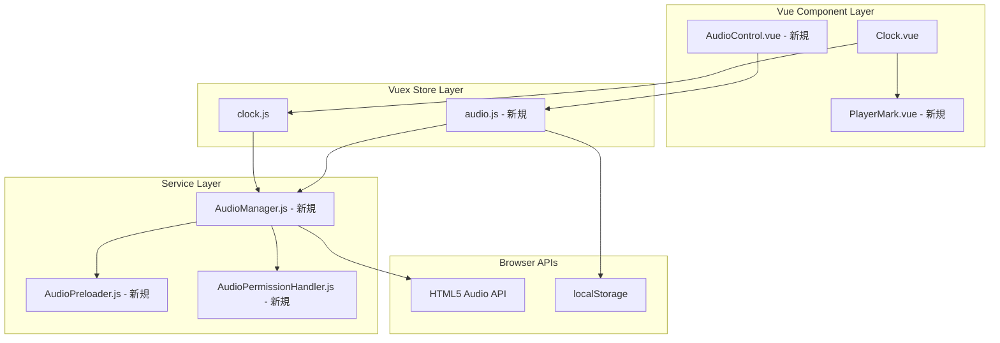
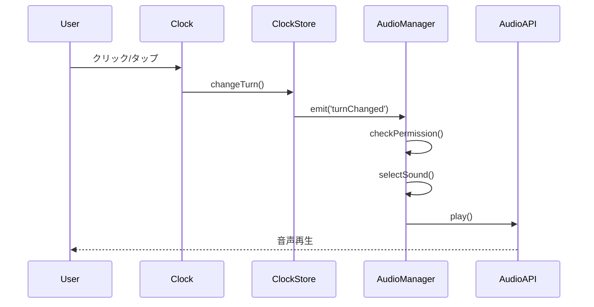
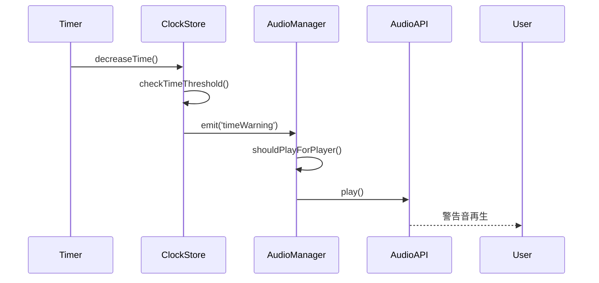
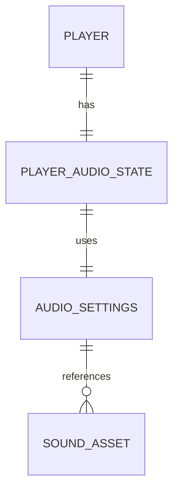
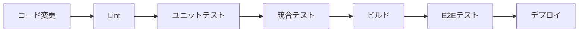

# 技術設計書

## 概要
webchessclockアプリケーションに音声フィードバック機能を追加する実装アプローチ。既存のVue.js/Nuxt.jsアーキテクチャに統合し、HTML5 Audio APIを使用してリアルタイムな音声フィードバックを提供します。ブラウザの自動再生ポリシーに準拠し、パフォーマンスへの影響を最小限に抑えながら、直感的な音声体験を実現します。

## 要件マッピング

### 設計コンポーネントのトレーサビリティ
各設計コンポーネントが対応する要件：
- **AudioManager** → 要件1: 基本音声フィードバック（ターン切り替え、警告音、時間切れアラート）
- **PlayerIndicator** → 要件2: プレイヤー識別と個人音声設定（識別マーク表示）
- **AudioPermissionHandler** → 要件3: ブラウザ互換性と音声許可（自動再生制限対応）
- **AudioPreloader** → 要件4: パフォーマンスと最適化（プリロード、キャッシング）
- **AudioStore Module** → 要件2: 個人音声設定の永続化（localStorage統合）

### ユーザーストーリーカバレッジ
- **ユーザーストーリー1（音声認識）**: AudioManagerがすべての時間イベントを監視し、適切な音声を再生
- **ユーザーストーリー2（個人識別）**: PlayerIndicatorとAudioStoreが連携して個人設定を管理
- **ユーザーストーリー3（互換性）**: AudioPermissionHandlerが各ブラウザの制限を適切に処理
- **ユーザーストーリー4（パフォーマンス）**: AudioPreloaderが音声ファイルを事前読み込み

## アーキテクチャ



### 技術スタック
- **フロントエンド**: Vue.js 2.x + Nuxt.js 2.x（既存）
- **音声処理**: HTML5 Audio API
- **状態管理**: Vuex（新規audioモジュール追加）
- **データ永続化**: localStorage（ユーザー設定保存）
- **音声フォーマット**: MP3（互換性）+ OGG（フォールバック）

### アーキテクチャ決定の根拠
- **HTML5 Audio API選択理由**: Web Audio APIより実装がシンプルで、チェスクロックの要件には十分な機能を提供
- **Vuexモジュール追加**: 既存のclockモジュールとの責任分離を明確化し、音声関連の状態を独立管理
- **localStorage使用**: 音声設定は個人設定のため、Redisではなくクライアント側で永続化
- **MP3 + OGGフォーマット**: ブラウザ互換性を最大化（MP3はほぼ全ブラウザ対応、OGGはFirefoxフォールバック）

## データフロー

### ターン切り替え時の音声再生フロー



### 時間警告の音声再生フロー



## コンポーネントとインターフェース

### バックエンドサービスとメソッドシグネチャ

```javascript
// AudioManager.js
class AudioManager {
  constructor(options) // 初期化とオプション設定
  preloadSounds() // すべての音声ファイルを事前読み込み
  playTurnChange(playerId) // ターン切り替え音を再生
  playTimeWarning(playerId, timeRemaining) // 時間警告音を再生
  playTimeUp(playerId) // 時間切れアラート音を再生
  playCountdown(playerId, seconds) // 秒読み音を再生（9-6秒: ピッ、5-1秒: ピー）
  setVolume(level) // 音量設定（0-100）
  setMuted(muted) // ミュート設定
  setPersonalMode(enabled) // 個人音声モード設定
  checkAndRequestPermission() // ブラウザ音声許可確認・要求
}

// AudioPreloader.js
class AudioPreloader {
  constructor(soundList) // 音声リスト初期化
  preload() // 非同期プリロード実行
  getAudio(soundName) // キャッシュから音声取得
  clearCache() // キャッシュクリア
}

// AudioPermissionHandler.js
class AudioPermissionHandler {
  checkAutoplayPolicy() // 自動再生ポリシー確認
  requestUserInteraction() // ユーザー操作要求
  handlePermissionDenied() // 許可拒否時の処理
  isAudioAllowed() // 音声再生可能か確認
}
```

### フロントエンドコンポーネント

| コンポーネント名 | 責任 | Props/State概要 |
|---|---|---|
| AudioControl.vue | 音声設定UI | props: なし<br>state: volume, muted, personalMode |
| PlayerMark.vue | プレイヤー識別マーク表示 | props: playerId, isCurrentPlayer<br>state: なし |
| Clock.vue（既存改修） | 音声イベント発火 | 既存props/stateに加えて音声イベントemit |

### Vuexモジュール

```javascript
// store/audio.js
export const state = () => ({
  enabled: true,           // 音声機能の有効/無効
  volume: 80,             // 音量（0-100）
  muted: false,           // ミュート状態
  personalMode: false,    // 個人音声モード
  currentPlayerId: null,  // 現在のプレイヤーID
  soundType: 'default',   // 音声タイプ（将来の拡張用）
  permission: 'pending'   // 音声許可状態
})

export const mutations = {
  SET_ENABLED(state, enabled)
  SET_VOLUME(state, volume)
  SET_MUTED(state, muted) 
  SET_PERSONAL_MODE(state, enabled)
  SET_CURRENT_PLAYER(state, playerId)
  SET_PERMISSION(state, status)
  LOAD_SETTINGS(state) // localStorageから設定読み込み
  SAVE_SETTINGS(state) // localStorageに設定保存
}

export const actions = {
  initializeAudio({ commit })
  updateVolume({ commit }, volume)
  toggleMute({ commit })
  togglePersonalMode({ commit })
  setCurrentPlayer({ commit }, playerId)
  requestPermission({ commit })
}
```

## データモデル

### ドメインエンティティ
1. **AudioSettings**: ユーザーの音声設定
2. **SoundAsset**: 音声ファイル情報
3. **PlayerAudioState**: プレイヤー別音声状態

### エンティティ関係



### データモデル定義

```typescript
// TypeScript インターフェース
interface AudioSettings {
  enabled: boolean;
  volume: number; // 0-100
  muted: boolean;
  personalMode: boolean;
  soundType: 'default' | 'classic' | 'modern'; // 将来の拡張
}

interface SoundAsset {
  name: string;
  url: string;
  format: 'mp3' | 'ogg';
  duration: number; // ミリ秒
  preloaded: boolean;
}

interface PlayerAudioState {
  playerId: string;
  isCurrentPlayer: boolean;
  lastSoundPlayed: string | null;
  lastPlayedAt: Date | null;
}
```

### localStorage構造
```javascript
// localStorage キー: 'webchessclock-audio-settings'
{
  "enabled": true,
  "volume": 80,
  "muted": false,
  "personalMode": false,
  "soundType": "default"
}
```

## 音声素材仕様

### 必要な音声ファイル
| ファイル名 | 用途 | 推奨長さ | 説明 |
|---|---|---|---|
| turn-change.mp3/ogg | ターン切り替え | 0.2-0.3秒 | クリック音や軽快な音 |
| time-warning.mp3/ogg | 10秒前警告 | 0.5秒 | 注意を引く警告音 |
| time-up.mp3/ogg | 時間切れ | 1-2秒 | 終了を示す明確な音 |
| countdown-tick.mp3/ogg | 秒読み（9-6秒） | 0.1秒 | 短いピッ音<br>- 9秒: ピッ音<br>- 8秒: ピッ音<br>- 7秒: ピッ音<br>- 6秒: ピッ音 |
| countdown-urgent.mp3/ogg | 秒読み（5-1秒） | 1秒 | 1秒間継続するピー音 |

### 音声ファイル要件
- **フォーマット**: MP3（主要）+ OGG（Firefox用フォールバック）
- **ビットレート**: 128kbps（ファイルサイズと品質のバランス）
- **サンプルレート**: 44.1kHz
- **音量正規化**: -12dB LUFS
- **合計サイズ目標**: < 200KB（全ファイル合計）

### ファイル配置
```
static/
└── sounds/
    ├── turn-change.mp3
    ├── turn-change.ogg
    ├── time-warning.mp3
    ├── time-warning.ogg
    ├── time-up.mp3
    ├── time-up.ogg
    ├── countdown-tick.mp3
    ├── countdown-tick.ogg
    ├── countdown-urgent.mp3
    └── countdown-urgent.ogg
```

### 音声素材の入手オプション

#### オプション1: フリー素材利用
推奨サイト：
- Freesound.org（CC0ライセンス）
- 効果音ラボ（商用利用可）
- Zapsplat（要登録、商用可）

#### オプション2: Web Audio API生成（フォールバック）
音声ファイルが用意できない場合の代替実装：

```javascript
// services/SoundGenerator.js
export class SoundGenerator {
  constructor() {
    this.audioContext = new (window.AudioContext || window.webkitAudioContext)();
  }

  playTurnChange() {
    this.playTone(800, 100); // 800Hz, 100ms
  }

  playTimeWarning() {
    this.playTone(600, 300, 'sawtooth'); // 600Hz, 300ms, 鋸波
  }

  playTimeUp() {
    // 複数音の組み合わせ
    this.playTone(400, 200);
    setTimeout(() => this.playTone(300, 300), 200);
  }

  playCountdownTick(seconds) {
    if (seconds >= 6) {
      // 9秒: ピッ音
      // 8秒: ピッ音
      // 7秒: ピッ音
      // 6秒: ピッ音（計4回）
      this.playTone(1000, 50); // 1000Hz, 50ms
    } else {
      // 5-1秒: 1秒間継続するピー音
      this.playTone(1200, 1000, 'triangle'); // 1200Hz, 1000ms（1秒）, 三角波
    }
  }

  playTone(frequency, duration, type = 'sine') {
    const oscillator = this.audioContext.createOscillator();
    const gainNode = this.audioContext.createGain();
    
    oscillator.connect(gainNode);
    gainNode.connect(this.audioContext.destination);
    
    oscillator.frequency.value = frequency;
    oscillator.type = type;
    
    gainNode.gain.setValueAtTime(0.3, this.audioContext.currentTime);
    gainNode.gain.exponentialRampToValueAtTime(
      0.01, 
      this.audioContext.currentTime + duration / 1000
    );
    
    oscillator.start(this.audioContext.currentTime);
    oscillator.stop(this.audioContext.currentTime + duration / 1000);
  }
}
```

### 実装の柔軟性
AudioManagerは音声ファイルの有無を検出し、自動的に適切な実装を選択：
1. 音声ファイルが存在 → HTML5 Audio APIを使用
2. 音声ファイルが不在 → SoundGeneratorにフォールバック
3. Web Audio API非対応 → サイレントモード（視覚フィードバックのみ）

## エラーハンドリング

### 音声再生エラー処理
```javascript
try {
  await audio.play();
} catch (error) {
  if (error.name === 'NotAllowedError') {
    // 自動再生ブロック - ユーザー操作を要求
    store.commit('audio/SET_PERMISSION', 'denied');
    showPermissionBanner();
  } else if (error.name === 'NotSupportedError') {
    // フォーマット非対応 - フォールバック音声使用
    playFallbackSound();
  } else {
    // その他のエラー - サイレントフェイル
    console.error('Audio playback failed:', error);
  }
}
```

## セキュリティ考慮事項

### 音声ファイルの安全性
- すべての音声ファイルは`/static/sounds/`ディレクトリに配置
- Content-Typeヘッダーの適切な設定
- 外部URLからの音声読み込みは禁止

### ブラウザセキュリティポリシー準拠
- 自動再生ポリシーへの準拠（ユーザー操作後のみ再生）
- CORS設定の適切な構成
- Mixed Content警告の回避（HTTPS環境での運用）

## パフォーマンスと最適化

### パフォーマンス目標
| メトリクス | 目標値 | 測定方法 |
|---|---|---|
| 音声再生遅延 | < 50ms | ユーザー操作から音声開始まで |
| プリロード完了時間 | < 2秒 | ページ読み込み後 |
| メモリ使用量増加 | < 5MB | 音声キャッシュ含む |
| CPU使用率増加 | < 1% | アイドル時 |

### キャッシング戦略
- **ブラウザキャッシュ**: 音声ファイルは1年間キャッシュ
- **メモリキャッシュ**: AudioPreloaderで音声オブジェクトを保持
- **プリロード**: ページ読み込み時に全音声を非同期プリロード

### 最適化アプローチ
- 音声ファイルの圧縮（MP3 128kbps）
- 短い音声クリップ（< 1秒）の使用
- 音声スプライトの検討（将来の最適化）
- Web Workerでのプリロード処理（必要に応じて）

## テスト戦略

### テストカバレッジ要件
- **ユニットテスト**: AudioManager、AudioPreloader、Vuexモジュール
- **統合テスト**: Clock.vueとAudioManagerの連携
- **E2Eテスト**: ユーザー操作から音声再生まで
- **ブラウザ互換性テスト**: Chrome、Firefox、Safari、Edge

### テストアプローチ
1. **ユニットテスト**
   ```javascript
   // AudioManager.test.js
   describe('AudioManager', () => {
     test('playTurnChange plays correct sound', () => {});
     test('respects personal mode setting', () => {});
     test('handles permission denied gracefully', () => {});
   });
   ```

2. **統合テスト**
   ```javascript
   // Clock.integration.test.js
   describe('Clock with Audio', () => {
     test('turn change triggers audio', () => {});
     test('time warning plays at 10 seconds', () => {});
   });
   ```

3. **E2Eテスト**
   ```javascript
   // audio.e2e.test.js
   describe('Audio Feature E2E', () => {
     test('user can enable/disable audio', () => {});
     test('audio plays on turn change', () => {});
   });
   ```

### CI/CDパイプライン統合
