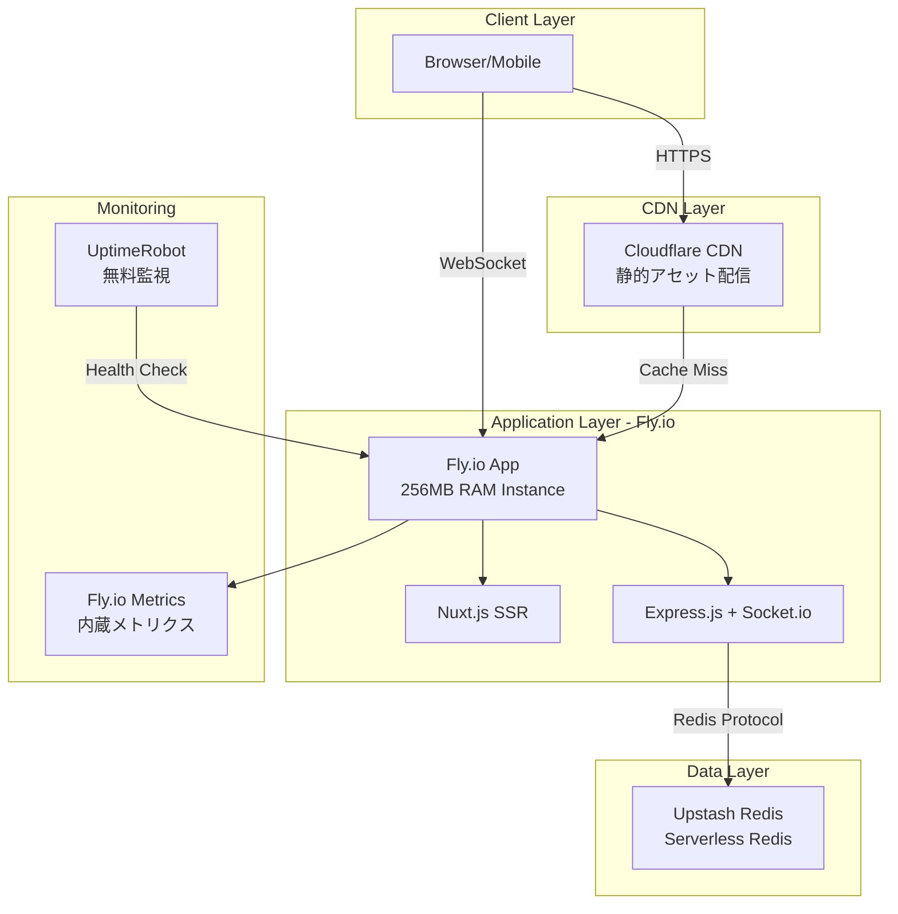
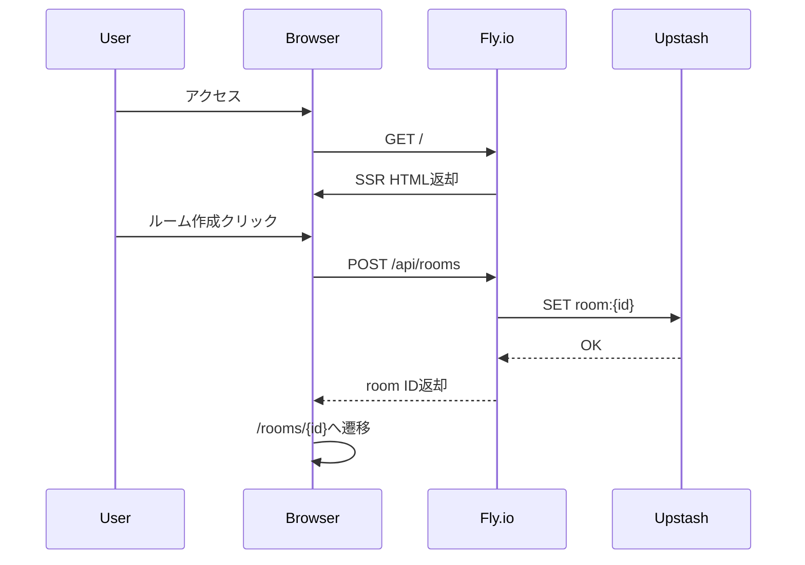
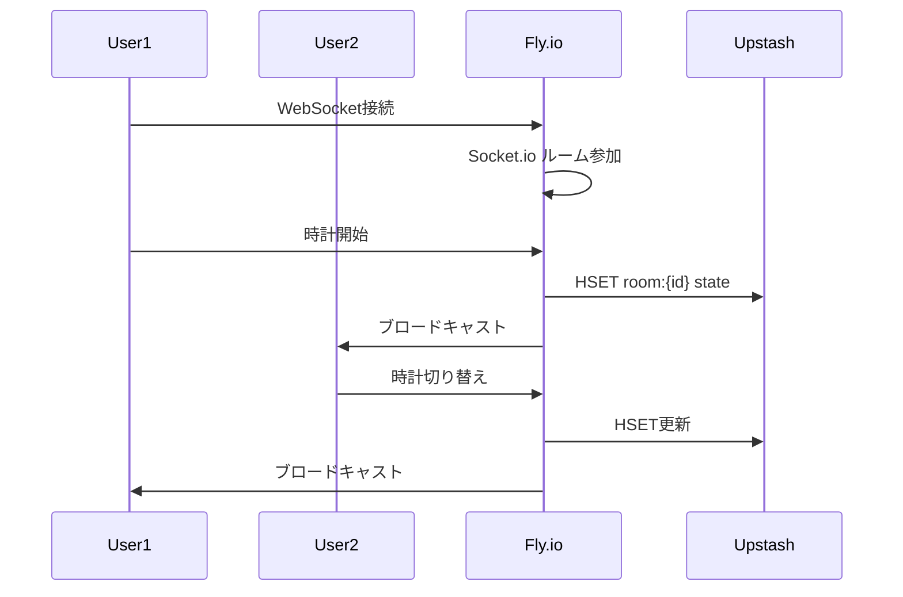
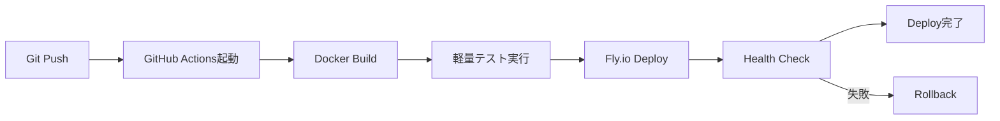

# Technical Design

## 概要

webchessclockアプリケーションを低コスト環境でコンテナ化し、デプロイするための技術設計書です。本設計は、月額$0〜$10の予算制約の中で、Nuxt.js + Express.js + Socket.io + Redisアーキテクチャを効率的に運用することを目的としています。

主要な技術選択：
- **デプロイプラットフォーム**: Fly.io（無料枠活用）
- **コンテナ技術**: Docker with Alpine Linux
- **データストア**: Upstash Redis（従量課金）
- **CI/CD**: GitHub Actions（無料枠）

## 要件マッピング

### 設計コンポーネントのトレーサビリティ

各設計コンポーネントと要件の対応関係：

- **Dockerコンテナ設計** → 要件1: コンテナ化戦略（マルチステージビルド、最小イメージサイズ）
- **Fly.ioプラットフォーム** → 要件2: デプロイメントプラットフォーム選定（$0ベース従量課金）
- **GitHub Actions CI/CD** → 要件3: CI/CDパイプライン構築（自動ビルド・デプロイ）
- **環境変数管理** → 要件4: 環境構成管理（.env、シークレット管理）
- **ログ集約システム** → 要件5: 低コストモニタリング（stdout/stderr、7日保持）
- **単一インスタンス構成** → 要件6: 低トラフィック環境最適化（256MB RAM）
- **Upstash Redis** → 要件7: 低コストデータ永続化（10,000コマンド/日無料）
- **セキュリティ実装** → 要件8: セキュリティ対策（非rootユーザー、HTTPS）
- **コスト監視** → 要件9: コスト最適化戦略（$8アラート、CDN活用）

### ユーザーストーリーカバレッジ

- **開発者ストーリー**: Docker化により開発/本番環境の一貫性を実現
- **プロダクトオーナーストーリー**: Fly.io + Upstash Redisで$0ベース運用を実現
- **DevOpsストーリー**: GitHub Actionsで完全自動化されたデプロイメントパイプライン
- **運用担当者ストーリー**: 最小限のコストで必要十分な監視体制を構築

## アーキテクチャ

### システム全体構成



### 技術スタック

#### コンテナ・インフラ層
- **ベースイメージ**: node:18-alpine（軽量Linux）
- **コンテナランタイム**: Fly.io Firecracker microVM
- **リバースプロキシ**: Fly.io Edge Network

#### アプリケーション層
- **フロントエンド**: Nuxt.js 2.x（既存）+ TypeScript
- **バックエンド**: Express.js 4.x + Socket.io 2.x（既存）
- **状態管理**: Vuex（既存）

#### データ層
- **キャッシュ/セッション**: Upstash Redis（Serverless）
- **永続化戦略**: 24時間TTLでの自動削除

#### 監視・ロギング層
- **アップタイム監視**: UptimeRobot Free
- **ログ収集**: Fly.io内蔵ログ（7日保持）
- **メトリクス**: Fly.io Grafana（内蔵）

### アーキテクチャ決定の根拠

#### なぜFly.io？
- **調査結果**: 無料枠で256MB RAM x 3インスタンスが利用可能
- **WebSocketサポート**: ネイティブ対応、永続的接続が可能
- **コールドスタートなし**: 常時稼働で応答性を保証
- **グローバル展開**: 必要に応じて世界中のリージョンに展開可能

#### なぜUpstash Redis？
- **完全従量課金**: 使用しない時は$0
- **無料枠**: 10,000コマンド/日（低トラフィックには十分）
- **エッジ対応**: グローバルレプリケーション可能
- **REST API**: HTTPSで接続可能（ファイアウォール制約なし）

#### なぜAlpine Linux？
- **最小サイズ**: ベースイメージが5MB程度
- **セキュリティ**: 最小構成で攻撃対象領域を削減
- **パフォーマンス**: 起動時間とメモリ使用量を最小化

## データフロー

### プライマリユーザーフロー

#### 1. ルーム作成フロー


#### 2. WebSocket接続フロー


## コンポーネントと インターフェース

### Dockerコンテナ構成

```dockerfile
# マルチステージビルド設計
# Stage 1: Dependencies
FROM node:18-alpine AS deps
WORKDIR /app
COPY package*.json ./
RUN npm ci --only=production

# Stage 2: Build
FROM node:18-alpine AS builder
WORKDIR /app
COPY package*.json ./
RUN npm ci
COPY . .
RUN npm run build

# Stage 3: Runtime (最小構成)
FROM node:18-alpine AS runtime
WORKDIR /app
RUN addgroup -g 1001 -S nodejs && \
    adduser -S nodejs -u 1001
COPY --from=deps --chown=nodejs:nodejs /app/node_modules ./node_modules
COPY --from=builder --chown=nodejs:nodejs /app/.nuxt ./.nuxt
COPY --from=builder --chown=nodejs:nodejs /app/static ./static
COPY --from=builder --chown=nodejs:nodejs /app/server ./server
COPY --from=builder --chown=nodejs:nodejs /app/nuxt.config.js ./
COPY --from=builder --chown=nodejs:nodejs /app/package*.json ./

USER nodejs
EXPOSE 3000
ENV NODE_ENV=production
CMD ["npm", "start"]
```

### 環境変数設計

| 変数名 | 用途 | デフォルト値 | 必須 |
|--------|------|------------|------|
| NODE_ENV | 実行環境 | production | Yes |
| PORT | アプリケーションポート | 3000 | Yes |
| REDIS_URL | Upstash Redis接続URL | - | Yes |
| HOST | バインドホスト | 0.0.0.0 | Yes |
| LOG_LEVEL | ログレベル | info | No |

### APIエンドポイント

| メソッド | ルート | 目的 | 認証 | ステータスコード |
|---------|--------|------|------|-----------------|
| GET | /health | ヘルスチェック | 不要 | 200, 503 |
| GET | / | ホームページ（SSR） | 不要 | 200 |
| GET | /rooms/:id | ルームページ（SSR） | 不要 | 200, 404 |
| WS | /socket.io | WebSocket接続 | 不要 | 101, 400 |

## データモデル

### Redisデータ構造

```typescript
// ルームデータ（Redis Hash）
interface RoomData {
  roomId: string;          // ルームID
  turn: number;           // 現在のターン（プレイヤー番号）
  pause: boolean;         // 一時停止状態
  nPlayers: number;       // プレイヤー数
  masterTime: number;     // 持ち時間（分）
  masterCountdown: number; // 秒読み（秒）
  masterAdditional: number; // 追加時間（秒）
  times: string;          // 各プレイヤーの残り時間（JSON）
  countdowns: string;     // 各プレイヤーの秒読み（JSON）
  lastAccess: number;     // 最終アクセス時刻（UNIX時間）
}
```

### データ永続化戦略

```javascript
// TTL設定（24時間）
const ROOM_TTL = 24 * 60 * 60; // 24時間

// データ保存時
await redis.hset(`room:${roomId}`, data);
await redis.expire(`room:${roomId}`, ROOM_TTL);

// アクセス時のTTL更新
await redis.expire(`room:${roomId}`, ROOM_TTL);
```

## エラーハンドリング

### エラー処理戦略

```javascript
// グローバルエラーハンドラー
class ErrorHandler {
  static handle(error, context) {
    // ログ出力（stdout）
    console.error(JSON.stringify({
      timestamp: new Date().toISOString(),
      level: 'error',
      message: error.message,
      stack: process.env.NODE_ENV === 'development' ? error.stack : undefined,
      context
    }));
    
    // Redis接続エラー時のフォールバック
    if (error.code === 'ECONNREFUSED') {
      // インメモリモードに切り替え
      return this.fallbackToMemory();
    }
    
    // WebSocketエラー時の再接続
    if (error.type === 'websocket') {
      return this.reconnectWebSocket();
    }
  }
}
```

## セキュリティ考慮事項

### 認証・認可

- ルームアクセスはURLベース（認証不要）
- ルームIDは推測困難なランダム文字列
- Rate Limiting: Fly.io Edge でのレート制限

### データ保護

```javascript
// 入力検証
const validateRoomId = (id) => /^[a-zA-Z0-9-_]{6,12}$/.test(id);
const validatePlayerCount = (n) => n >= 2 && n <= 100;
const validateTime = (t) => t >= 0 && t <= 720;

// XSS対策
// Vue.jsの自動エスケープに依存

// HTTPS強制
// Fly.ioで自動的にHTTPS化
```

### セキュリティベストプラクティス

- 非rootユーザーでの実行（nodejs:1001）
- 最小権限の原則（必要なポートのみ公開）
- 依存関係の定期更新（Dependabot使用）
- セキュリティヘッダー実装

```javascript
app.use(helmet({
  contentSecurityPolicy: {
    directives: {
      defaultSrc: ["'self'"],
      scriptSrc: ["'self'", "'unsafe-inline'"],
      styleSrc: ["'self'", "'unsafe-inline'"],
      connectSrc: ["'self'", "wss:", "https:"]
    }
  }
}));
```

## パフォーマンスとスケーラビリティ

### パフォーマンスターゲット

| メトリクス | 目標値 | 測定方法 |
|-----------|--------|---------|
| 初回表示時間（FCP） | < 2秒 | Lighthouse |
| WebSocket接続時間 | < 1秒 | カスタムメトリクス |
| 時計同期遅延 | < 100ms | Socket.io計測 |
| メモリ使用量 | < 200MB | Fly.io Metrics |
| CPU使用率 | < 50% | Fly.io Metrics |

### キャッシング戦略

```javascript
// 静的アセットのキャッシング
app.use(express.static('static', {
  maxAge: '1y',  // 1年間キャッシュ
  etag: true,
  lastModified: true
}));

// Cloudflare CDN設定
// Cache-Control: public, max-age=31536000
// 静的ファイルは自動的にエッジキャッシュ
```

### コスト最適化アプローチ

```javascript
// コスト監視
class CostMonitor {
  async checkUsage() {
    const redisCommands = await getRedisCommandCount();
    const flyioUsage = await getFlyioMetrics();
    
    if (redisCommands > 8000) { // 80%到達
      await sendAlert('Redis usage at 80%');
      await enableCostReductionMode();
    }
    
    if (flyioUsage.estimatedCost > 8) { // $8到達
      await sendAlert('Monthly cost approaching limit');
      await applyRateLimiting();
    }
  }
}
```

## テスト戦略

### テストカバレッジ要件

- **ユニットテスト**: 主要ロジックのテスト（ローカル実行）
- **統合テスト**: Redis接続、WebSocket通信のテスト
- **E2Eテスト**: 基本的なユーザーフローのテスト
- **負荷テスト**: 10同時接続での動作確認

### CI/CDパイプライン



### GitHub Actions設定

```yaml
name: Deploy to Fly.io
on:
  push:
    branches: [main]

jobs:
  deploy:
    runs-on: ubuntu-latest
    steps:
      - uses: actions/checkout@v3
      
      - name: Setup Node.js
        uses: actions/setup-node@v3
        with:
          node-version: '18'
          cache: 'npm'
      
      - name: Install and Test
        run: |
          npm ci
          npm run test:light  # 軽量テストのみ
      
      - name: Deploy to Fly.io
        uses: superfly/flyctl-actions@1.3
        with:
          args: "deploy --remote-only"
        env:
          FLY_API_TOKEN: ${{ secrets.FLY_API_TOKEN }}
```

## 実装フェーズ移行準備

### 次のステップ

1. **Fly.ioアカウント作成と初期設定**
2. **Upstash Redisアカウント作成**
3. **Dockerfile作成とローカルテスト**
4. **fly.toml設定ファイル作成**
5. **GitHub Actions設定**
6. **初回デプロイと動作確認**

### リスクと対策

| リスク | 影響度 | 対策 |
|--------|--------|------|
| 無料枠超過 | 高 | 使用量監視とアラート設定 |
| WebSocket切断 | 中 | 自動再接続実装 |
| Redis接続失敗 | 中 | インメモリフォールバック |
| コールドスタート | 低 | Fly.ioは常時稼働 |